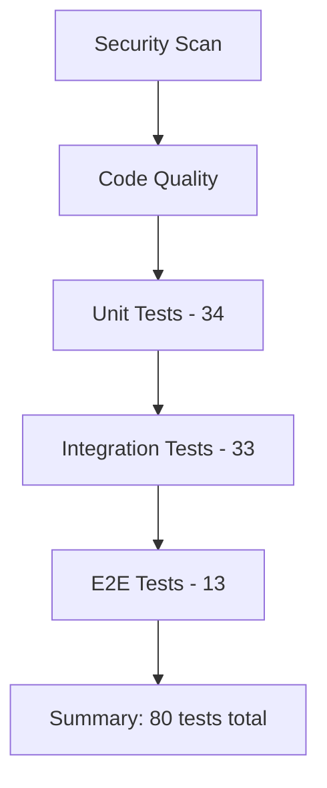

# GitHub Actions Workflows

Este projeto utiliza **3 workflows** do GitHub Actions para garantir a qualidade do código através da **pirâmide de testes completa**.

## 🔄 Workflows Implementados

### 1. **CI Pipeline** (`.github/workflows/ci.yml`)
**Workflow principal** que executa testes RSpec (unit + integration)
- ✅ Security scanning (Brakeman)
- ✅ JavaScript audit (Importmap)
- ✅ Code linting (RuboCop)
- ✅ Unit tests (34 testes)
- ✅ Integration tests (33 testes)
- ✅ Coverage reports

### 2. **E2E Tests** (`.github/workflows/e2e.yml`) 
**Workflow dedicado** para testes end-to-end com Cucumber
- ✅ Browser testing (Chrome)
- ✅ Cucumber scenarios (13 cenários)
- ✅ Capybara integration
- ✅ Screenshot artifacts
- ✅ Test result reports

## 🗂️ Estrutura de Execução



## 📊 Triggers

Todos os workflows são executados em:
- **Pull Requests** para `main`
- **Pushes** para branch `main`

## 🛠️ Configuração

### Database
- **Development & CI**: PostgreSQL 15
- **Reason**: Consistência entre environments, features avançadas do PostgreSQL

### Artifacts
- **Coverage Reports**: HTML coverage do SimpleCov
- **E2E Results**: XML reports do Cucumber
- **Screenshots**: Em caso de falhas nos testes E2E
- **Logs**: Application logs para debugging

## 🚀 Como Usar

### Executar Localmente
```bash
# Replicar o CI localmente
bundle exec rspec spec/models/     # Unit tests
bundle exec rspec spec/controllers/ # Integration tests  
bundle exec cucumber              # E2E tests

# Com coverage
COVERAGE=true bundle exec rspec
```

### Monitorar no GitHub
1. Vá para a aba **Actions** do repositório
2. Veja os workflows em execução
3. Baixe artifacts quando necessário
4. Monitore o status dos PRs

## 📈 Métricas de Sucesso

- ✅ **80 testes total** executados
- ✅ **100% pass rate** obrigatório
- ✅ **Coverage reports** gerados
- ✅ **Security scans** limpos
- ✅ **Linting** sem erros

---

**💡 Resultado**: Pipeline de CI/CD confiável com testing pyramid completo!
